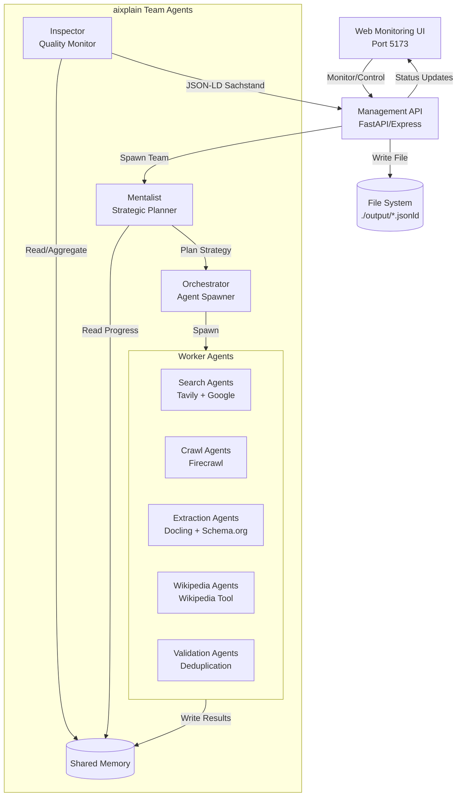
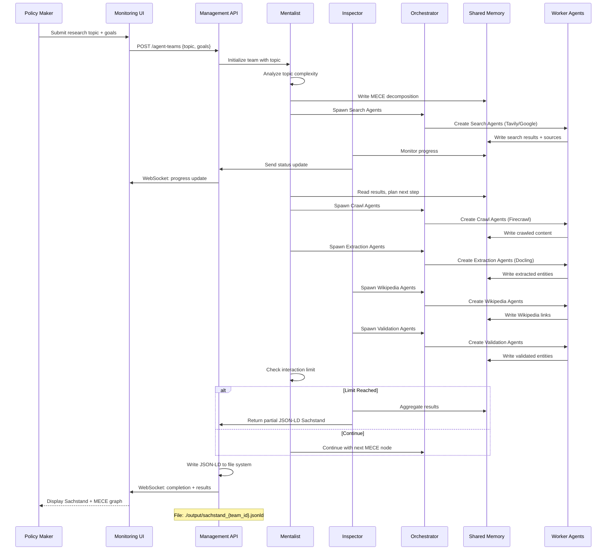

# Design Document

## Overview

The Honeycomb OSINT Agent Team System is designed to enable policy makers at the Ministerium für Soziales, Gesundheit und Integration to conduct automated, comprehensive research on policy-relevant topics. The system leverages aixplain.com team agents to orchestrate web research, entity extraction, and knowledge graph construction, returning structured results in JSON-LD format.

### Key Design Principles

1. **Walking Skeleton First**: Build end-to-end functionality with core team structure before adding complexity
   - Start with core team: Mentalist, Inspector, Orchestrator, Bodyguard
   - Add minimal worker: 1 Search Agent with Tavily tool
   - Mentalist uses simple strategy (no MECE decomposition yet)
   - Inspector aggregates entities to JSON-LD
   - Get JSON-LD output working end-to-end
   - Then add more worker agents, tools, and MECE features incrementally

2. **Test-Driven Development (TDD)**: Write tests before implementation
   - Unit tests for core logic
   - Integration tests for agent interactions
   - Evaluation tests with real topics

3. **Behavior-Driven Development (BDD)**: Define behavior in user terms
   - Given-When-Then scenarios for key features
   - Executable specifications
   - Living documentation

4. **Modularity**: Separate concerns between API management, agent orchestration, entity extraction, and UI monitoring

5. **Scalability**: Support multiple concurrent agent teams researching different topics

6. **Structured Output**: Use schema.org vocabulary and JSON-LD for interoperability with knowledge graph backends

7. **Manageable Scope**: Employ MECE decomposition with depth-first strategy and interaction limits to ensure timely results

8. **Traceability**: Include deep links to all source materials for verification and audit

9. **Incremental Complexity**: Start simple, add features based on feedback
   - Phase 1: Core team + Search Agent (Tavily), simple strategy, basic entity extraction
   - Phase 2: Add MECE decomposition to Mentalist, add more worker agents
   - Phase 3: Add Wikipedia linking and deduplication agents
   - Phase 4: Advanced monitoring and visualization

## Walking Skeleton V2 Architecture

The walking skeleton implements the **core team structure** from the start, but with simplified functionality:

### Core Team (Phase 1)
```
┌─────────────────────────────────────────────────────────┐
│              TEAM AGENT (Built-in Micro Agents)         │
├─────────────────────────────────────────────────────────┤
│                                                         │
│  ┌──────────────┐  ┌──────────────┐  ┌──────────────┐ │
│  │  Mentalist   │  │  Inspector   │  │ Orchestrator │ │
│  │  (built-in)  │  │  (built-in)  │  │  (built-in)  │ │
│  │              │  │              │  │              │ │
│  │ Plans simple │  │ Reviews      │  │ Routes to    │ │
│  │ strategy     │  │ output       │  │ Search Agent │ │
│  │ (no MECE)    │  │              │  │              │ │
│  └──────────────┘  └──────────────┘  └──────┬───────┘ │
│                                              │         │
│  ┌──────────────────────────────────────────┘         │
│  │  Response Generator (built-in)                     │
│  │  Creates final output from agent results           │
│  └────────────────────────────────────────────────────┘│
└──────────────────────────────────────────────┼─────────┘
                                               │
                    ┌──────────────────────────┘
                    │
┌───────────────────┼─────────────────────────────────────┐
│                   │   USER-DEFINED AGENTS               │
├───────────────────┼─────────────────────────────────────┤
│                   ▼                                     │
│  ┌──────────────────┐                                  │
│  │  Search Agent    │                                  │
│  │  (user-defined)  │                                  │
│  │                  │                                  │
│  │ • Tavily Search  │                                  │
│  │ • Extract        │                                  │
│  │   entities       │                                  │
│  │ • Return results │                                  │
│  └──────────────────┘                                  │
└────────────────────────────────────────────────────────┘
```

**Note**: Mentalist, Inspector, Orchestrator, and Response Generator are **built-in micro agents** automatically created by `TeamAgentFactory.create()`. We only define user agents (Search Agent).

### Walking Skeleton Flow
1. API creates team using `TeamAgentFactory.create()` with:
   - Built-in micro agents: Mentalist, Inspector, Orchestrator, Response Generator
   - User-defined agent: Search Agent (with Tavily tool)
   - Instructions for Mentalist
   - WorkflowTask defining Search Agent's work
2. Mentalist analyzes topic and creates simple execution plan (no MECE)
3. Orchestrator routes task to Search Agent
4. Search Agent uses Tavily to research and extract entities
5. Search Agent returns results with entities
6. Inspector reviews output for quality and compliance
7. Response Generator synthesizes final output from Search Agent results
8. API receives response from team
9. API formats response to JSON-LD Sachstand
10. API writes JSON-LD to file

### Benefits of V2 Approach
- **Core team structure in place** - Built-in micro agents (Mentalist, Inspector, Orchestrator, Response Generator)
- **Inspector reviews output** - Ensures quality and compliance
- **Mentalist plans strategy** - Even simple strategy establishes pattern
- **Orchestrator routes tasks** - Manages execution flow
- **Response Generator synthesizes** - Creates final output from agent results
- **API formats to JSON-LD** - Simple transformation of team response
- **Scalable** - Easy to add more user-defined agents (Crawl, Extraction, Wikipedia)

## Architecture

### High-Level Architecture



### Component Interaction Flow



## Components and Interfaces

### 1. Management API

**Technology**: FastAPI (Python) with Poetry for dependency management

**Responsibilities**:
- Accept research requests with topic and goals
- Spawn and manage aixplain agent teams (Mentalist, Inspector, Orchestrator)
- Configure team with tools (Tavily, Google Search, Wikipedia, Docling, Firecrawl) - tool authentication handled by aixplain
- Track agent team status and progress via aixplain API
- Monitor agent logs and shared memory
- Receive JSON-LD Sachstand results from Inspector
- Write JSON-LD Sachstand to file system (for downstream Apache Jena Fuseki integration by other systems)
- Provide status updates to monitoring UI via WebSocket

**API Endpoints**:

```
POST /api/v1/agent-teams
Body: {
  "topic": "Integration policies for refugees in Baden-Württemberg",
  "goals": ["Identify key stakeholders", "Timeline of policy changes", "Current challenges"],
  "interaction_limit": 50,
  "mece_strategy": "depth_first"
}
Response: {
  "team_id": "uuid",
  "aixplain_team_id": "aixplain-uuid",
  "status": "running",
  "created_at": "timestamp"
}

GET /api/v1/agent-teams
Response: [{
  "team_id": "uuid",
  "aixplain_team_id": "aixplain-uuid",
  "topic": "...",
  "status": "running|completed|aborted",
  "progress": 0.45,
  "created_at": "timestamp",
  "updated_at": "timestamp"
}]

GET /api/v1/agent-teams/{team_id}
Response: {
  "team_id": "uuid",
  "aixplain_team_id": "aixplain-uuid",
  "topic": "...",
  "goals": [...],
  "status": "completed",
  "mece_graph": {...},
  "entities_extracted": 42,
  "sachstand_url": "/api/v1/sachstand/{team_id}",
  "execution_log": [...]
}

GET /api/v1/agent-teams/{team_id}/logs
Response: {
  "team_id": "uuid",
  "logs": [
    {
      "timestamp": "2025-10-08T10:15:00Z",
      "agent": "mentalist",
      "level": "info",
      "message": "Created MECE decomposition with 4 dimensions"
    },
    {
      "timestamp": "2025-10-08T10:16:00Z",
      "agent": "orchestrator",
      "level": "info",
      "message": "Spawned 2 Search Agents"
    },
    {
      "timestamp": "2025-10-08T10:17:00Z",
      "agent": "search_agent_1",
      "level": "info",
      "message": "Found 15 relevant sources using Tavily"
    }
  ]
}

GET /api/v1/agent-teams/{team_id}/shared-memory
Response: {
  "team_id": "uuid",
  "mece_graph": {...},
  "entities": [...],
  "sources": [...],
  "wikipedia_links": [...]
}

DELETE /api/v1/agent-teams/{team_id}
Response: {
  "team_id": "uuid",
  "status": "aborted"
}

GET /api/v1/sachstand/{team_id}
Response: {
  "file_path": "./output/sachstand_{team_id}.jsonld",
  "content": {
    "@context": "https://schema.org",
    "@type": "ResearchReport",
    "topic": "...",
    "entities": [...],
    "mece_coverage": {...},
    "completion_status": "partial|complete"
  }
}
```

**Integration with aixplain API**:

The Management API acts as a facade over the aixplain Team Agents API:

1. **Spawning Teams**: 
   - POST to aixplain API to create team with Mentalist, Inspector, Orchestrator
   - Configure tools (Tavily, Google Search, Wikipedia, Docling, Firecrawl)
   - Tool authentication is handled by aixplain (no API keys needed in our system)
   - Store mapping between local team_id and aixplain_team_id
   - aixplain API key loaded from .env file

2. **Monitoring Status**:
   - Poll aixplain API for team status
   - Retrieve shared memory contents
   - Aggregate progress metrics (entities extracted, MECE coverage)

3. **Checking Logs**:
   - Fetch execution logs from aixplain API
   - Parse and format logs for UI display
   - Track agent spawning and tool usage

4. **Receiving Results**:
   - Inspector agent sends JSON-LD Sachstand via callback or polling
   - Management API validates JSON-LD format
   - Write JSON-LD to file system: `./output/sachstand_{team_id}.jsonld`
   - File can be consumed by downstream systems (Apache Jena Fuseki ETL pipeline)

### 2. Agent Team Orchestrator

**Technology**: aixplain.com Team Agents API with Inspector and Mentalist

**Responsibilities**:
- Coordinate research activities across multiple specialized agents
- Implement MECE decomposition logic via Mentalist
- Monitor agent performance and task allocation via Inspector
- Manage interaction limits and depth-first strategy
- Aggregate results from specialized agents via shared memory
- Generate JSON-LD Sachstand output

**Team Architecture**:

The team uses aixplain's recommended architecture with:
- **Mentalist**: Strategic planning agent that performs MECE decomposition and decides research strategy
- **Inspector**: Monitoring agent that tracks progress, manages shared memory, and ensures quality
- **Orchestrator**: Dynamically spawns and manages specialized worker agents based on Mentalist's plan
- **Shared Memory**: Central knowledge store accessible to all agents for coordination

**Specialized Worker Agents** (spawned dynamically by Orchestrator):

1. **Search Agents**: Perform web searches using Tavily Search and Google Search tools
2. **Crawl Agents**: Deep crawl websites using Firecrawl tool
3. **Extraction Agents**: Extract and parse content using Docling tool, identify schema.org entities
4. **Wikipedia Agents**: Link entities to Wikipedia using Wikipedia tool
5. **Validation Agents**: Check entity consistency, deduplication, and quality

**Available Tools**:
- **Tavily Search**: Web search optimized for AI agents
- **Google Search**: Comprehensive web search
- **Wikipedia**: Entity lookup and linking
- **Docling**: Document parsing and content extraction
- **Firecrawl**: Website crawling with actions:
  - `FIRECRAWL_MAP_URLS`: Discover URLs from base URL
  - `FIRECRAWL_CRAWL_URLS`: Crawl and extract content
  - `FIRECRAWL_CRAWL_JOB_STATUS`: Check crawl progress
  - `FIRECRAWL_CANCEL_CRAWL_JOB`: Cancel running crawls

**Configuration**:
```json
{
  "team_name": "honeycomb_research_team",
  "mentalist": {
    "role": "strategic_planner",
    "model": "gpt-4",
    "system_prompt": "You are a research strategist specializing in MECE decomposition for policy research. Analyze the topic, create a MECE structure, and plan the research strategy. Decide which agents to spawn and what tasks to assign based on topic complexity.",
    "responsibilities": [
      "Analyze topic complexity",
      "Create MECE decomposition",
      "Plan research strategy (depth-first)",
      "Decide agent spawning strategy",
      "Monitor interaction limits"
    ]
  },
  "inspector": {
    "role": "quality_monitor",
    "model": "gpt-4",
    "system_prompt": "You monitor research progress, manage shared memory, ensure entity quality, and track MECE coverage. You have access to all agent outputs and coordinate result aggregation.",
    "responsibilities": [
      "Monitor agent progress",
      "Manage shared memory",
      "Track MECE coverage",
      "Validate entity quality",
      "Aggregate results into JSON-LD"
    ]
  },
  "worker_agents": {
    "search_agent": {
      "model": "gpt-4",
      "tools": ["tavily_search", "google_search"],
      "system_prompt": "You perform web searches to find relevant information. Use Tavily for AI-optimized search and Google for comprehensive coverage.",
      "max_instances": 3
    },
    "crawl_agent": {
      "model": "gpt-4",
      "tools": ["firecrawl"],
      "system_prompt": "You crawl websites to extract detailed content. Use Firecrawl to map URLs and extract structured data from web pages.",
      "max_instances": 2
    },
    "extraction_agent": {
      "model": "gpt-4",
      "tools": ["docling"],
      "system_prompt": "You extract schema.org entities from content. Parse documents with Docling and identify entities (Person, Organization, Event, Legislation, etc.) with properties and relationships.",
      "max_instances": 2
    },
    "wikipedia_agent": {
      "model": "gpt-4",
      "tools": ["wikipedia"],
      "system_prompt": "You link extracted entities to Wikipedia articles in multiple languages. Check if entities exist in Wikipedia and retrieve Wikidata IDs for deduplication.",
      "max_instances": 1
    },
    "validation_agent": {
      "model": "gpt-4",
      "system_prompt": "You validate entities for consistency, deduplicate across sources, and ensure schema.org compliance. Access shared memory to check for duplicates.",
      "max_instances": 1
    }
  },
  "shared_memory": {
    "enabled": true,
    "structure": {
      "mece_graph": "Current MECE decomposition and coverage status",
      "entities": "Extracted entities with provenance",
      "sources": "Web sources and content",
      "wikipedia_links": "Entity-Wikipedia mappings"
    }
  },
  "interaction_limit": 50,
  "strategy": "depth_first_mece"
}
```

**Agent Workflow**:

1. **Mentalist** analyzes topic and creates MECE decomposition
2. **Mentalist** decides to spawn Search Agents for initial research
3. **Search Agents** use Tavily/Google to find relevant sources, write to shared memory
4. **Inspector** monitors progress and suggests next steps
5. **Mentalist** spawns Crawl Agents for deep content extraction
6. **Crawl Agents** use Firecrawl to extract detailed content, write to shared memory
7. **Mentalist** spawns Extraction Agents to process content
8. **Extraction Agents** use Docling to parse and extract schema.org entities
9. **Inspector** triggers Wikipedia Agents for entity linking
10. **Wikipedia Agents** link entities to Wikipedia, update shared memory
11. **Inspector** triggers Validation Agents for quality check
12. **Validation Agents** deduplicate and validate entities
13. **Inspector** aggregates results into JSON-LD Sachstand
14. **Mentalist** checks interaction limit and decides to continue or return results

### 3. Tool Integration Layer

**Technology**: aixplain Tool APIs (Tavily, Google Search, Wikipedia, Docling, Firecrawl)

**Responsibilities**:
- Provide unified interface to aixplain tools
- Handle tool authentication and configuration
- Manage rate limiting and retries
- Log tool usage for monitoring

**Available Tools**:

**Tavily Search**:
- AI-optimized web search
- Returns relevant, high-quality results
- Ideal for initial topic exploration

**Google Search**:
- Comprehensive web search
- Broader coverage than Tavily
- Good for finding government and official sources

**Wikipedia**:
- Entity lookup across languages
- Wikidata integration
- Authoritative source linking

**Docling**:
- Document parsing and content extraction
- Handles PDFs, HTML, and other formats
- Structured data extraction

**Firecrawl** (Tool ID: 686432a41223092cb4294d63):
- Website crawling and mapping
- Actions:
  - `FIRECRAWL_MAP_URLS`: Discover URLs from base URL with sitemap support
  - `FIRECRAWL_CRAWL_URLS`: Crawl and extract content with filtering
  - `FIRECRAWL_CRAWL_JOB_STATUS`: Monitor crawl progress
  - `FIRECRAWL_CANCEL_CRAWL_JOB`: Cancel active crawls
- Authentication: API_KEY
- Inputs: `full` (base URL), `generic_api_key` (FireCrawl API key)

**Tool Configuration**:

Tools are configured in aixplain and authentication is handled by aixplain's integration system. Our system only needs to specify which tools to enable for the agent team:

```json
{
  "tools": {
    "tavily_search": {
      "enabled": true,
      "max_results": 10
    },
    "google_search": {
      "enabled": true,
      "max_results": 10
    },
    "wikipedia": {
      "enabled": true,
      "languages": ["de", "en", "fr"]
    },
    "docling": {
      "enabled": true,
      "supported_formats": ["pdf", "html", "docx"]
    },
    "firecrawl": {
      "enabled": true,
      "tool_id": "686432a41223092cb4294d63",
      "max_concurrent_crawls": 2
    }
  }
}
```

Note: API keys and authentication are managed by aixplain's tool integration system (see https://docs.aixplain.com/concepts/tools/integrations/). Our application only needs the aixplain API key in the .env file.

### 4. Schema.org Entity Specification

**Technology**: Extraction Agents use schema.org vocabulary with Docling tool

**Schema.org Entity Types** (Priority for Ministry domain):
- **Person**: Politicians, officials, stakeholders (e.g., Dr. Manfred Lucha)
- **Organization**: Ministries, NGOs, service providers
- **GovernmentOrganization**: Specific subtype for government entities
- **Event**: Policy announcements, programs, conferences
- **Place**: Regions, cities, facilities (e.g., Baden-Württemberg)
- **Legislation**: Laws, regulations, policies (e.g., Integrationsgesetz)
- **CreativeWork**: Reports, studies, publications
- **GovernmentService**: Public services offered by the ministry

**Entity Extraction Guidelines for Agents**:

Extraction Agents should:
1. Use Docling to parse content and identify entity mentions
2. Classify entities according to schema.org types
3. Extract properties relevant to each type (name, description, dates, relationships)
4. Maintain provenance by linking each property to source URLs
5. Write entities to shared memory with unique IDs
6. Include confidence scores for ambiguous entities

**Example Entity Structure in Shared Memory**:
```json
{
  "entity_id": "uuid-123",
  "schema_type": "Person",
  "properties": {
    "name": "Dr. Manfred Lucha",
    "jobTitle": "Minister für Soziales, Gesundheit und Integration",
    "worksFor": {
      "@type": "GovernmentOrganization",
      "name": "Ministerium für Soziales, Gesundheit und Integration Baden-Württemberg"
    }
  },
  "sources": [
    {
      "url": "https://example.com/article",
      "accessed_at": "2025-10-08T10:15:00Z",
      "excerpt": "Dr. Manfred Lucha, Minister für..."
    }
  ],
  "confidence": 0.95
}
```

**JSON-LD Output Structure**:
```json
{
  "@context": "https://schema.org",
  "@type": "ResearchReport",
  "name": "Sachstand: Integration policies for refugees in Baden-Württemberg",
  "dateCreated": "2025-10-08T10:30:00Z",
  "author": {
    "@type": "SoftwareApplication",
    "name": "Honeycomb OSINT Agent Team",
    "version": "1.0"
  },
  "about": {
    "@type": "Thing",
    "name": "Integration policies for refugees in Baden-Württemberg"
  },
  "hasPart": [
    {
      "@type": "Person",
      "@id": "https://example.org/entity/person/123",
      "name": "Dr. Manfred Lucha",
      "jobTitle": "Minister für Soziales, Gesundheit und Integration",
      "worksFor": {
        "@type": "GovernmentOrganization",
        "name": "Ministerium für Soziales, Gesundheit und Integration Baden-Württemberg"
      },
      "sameAs": [
        "https://de.wikipedia.org/wiki/Manfred_Lucha",
        "https://www.wikidata.org/wiki/Q1889089"
      ],
      "citation": [
        {
          "@type": "WebPage",
          "url": "https://source1.example.com/article",
          "dateAccessed": "2025-10-08T10:15:00Z"
        }
      ]
    },
    {
      "@type": "Legislation",
      "@id": "https://example.org/entity/legislation/456",
      "name": "Integrationsgesetz Baden-Württemberg",
      "datePublished": "2015-11-01",
      "legislationJurisdiction": {
        "@type": "AdministrativeArea",
        "name": "Baden-Württemberg"
      },
      "citation": [
        {
          "@type": "WebPage",
          "url": "https://source2.example.com/law",
          "dateAccessed": "2025-10-08T10:20:00Z"
        }
      ]
    }
  ],
  "coverage": {
    "@type": "PropertyValue",
    "name": "MECE Coverage Graph",
    "value": {
      "dimensions": ["people", "policies", "timeline", "regions"],
      "nodes": [
        {"id": "people", "status": "complete", "entities": 15},
        {"id": "policies", "status": "partial", "entities": 8},
        {"id": "timeline", "status": "not_started", "entities": 0},
        {"id": "regions", "status": "complete", "entities": 12}
      ]
    }
  },
  "completionStatus": "partial",
  "remainingWork": ["timeline dimension", "complete policies dimension"]
}
```

### 5. MECE Decomposition Strategy (Mentalist)

**Technology**: Mentalist agent with strategic planning capabilities

**Responsibilities**:
- Analyze topic complexity based on research goals
- Propose MECE decomposition structure
- Generate graph representation in shared memory
- Track coverage status for each node
- Recommend next research areas using depth-first strategy
- Decide when to spawn additional agents

**MECE Dimensions**:
- **People**: Key stakeholders, decision-makers, affected populations
- **Subjects**: Policy areas, programs, services
- **Time**: Historical timeline, current state, future plans
- **Geography**: Regions, cities, facilities
- **Subtopics**: Specific aspects of the main topic

**Mentalist Decision Logic**:

1. **Topic Analysis**: Evaluate topic complexity based on:
   - Number of research goals
   - Breadth of topic (single entity vs. policy domain)
   - Time span (current vs. historical)
   - Geographic scope (local vs. state-wide)

2. **MECE Decomposition**: If complex, create structure:
   ```json
   {
     "dimensions": ["people", "policies", "timeline", "regions"],
     "nodes": [
       {
         "id": "people",
         "name": "Key Stakeholders",
         "children": ["ministers", "officials", "ngo_leaders"],
         "status": "not_started",
         "priority": 1
       },
       {
         "id": "policies",
         "name": "Integration Policies",
         "children": ["legislation", "programs", "services"],
         "status": "not_started",
         "priority": 2
       }
     ]
   }
   ```

3. **Agent Spawning Strategy**:
   - Start with 2-3 Search Agents for initial exploration
   - Spawn Crawl Agents when specific websites identified
   - Spawn Extraction Agents when content accumulated
   - Spawn Wikipedia/Validation Agents for post-processing

4. **Depth-First Execution**:
   - Select highest priority uncovered node
   - Assign agents to research that node completely
   - Mark node as complete before moving to next
   - Update MECE graph in shared memory

5. **Interaction Limit Management**:
   - Track total interactions across all agents
   - When approaching limit, prioritize completion of current node
   - Return partial results with clear indication of remaining work

### 6. Wikipedia Linking (Wikipedia Agents)

**Technology**: Wikipedia Agents using Wikipedia tool from aixplain

**Responsibilities**:
- Check if entities exist in Wikipedia (multiple languages)
- Retrieve Wikipedia URLs and Wikidata identifiers
- Link entities for deduplication and authority
- Write links to shared memory

**Wikipedia Agent Workflow**:

1. **Read Entities from Shared Memory**: Get entities extracted by Extraction Agents
2. **Search Wikipedia**: For each entity, search Wikipedia in multiple languages (de, en, fr)
3. **Retrieve Wikidata ID**: Extract Wikidata identifier from Wikipedia article
4. **Write Links to Shared Memory**: Update entity with Wikipedia URLs and Wikidata ID

**Example Wikipedia Link in Shared Memory**:
```json
{
  "entity_id": "uuid-123",
  "wikipedia_links": [
    {
      "language": "de",
      "url": "https://de.wikipedia.org/wiki/Manfred_Lucha",
      "title": "Manfred Lucha"
    },
    {
      "language": "en",
      "url": "https://en.wikipedia.org/wiki/Manfred_Lucha",
      "title": "Manfred Lucha"
    }
  ],
  "wikidata_id": "Q1889089",
  "sameAs": [
    "https://de.wikipedia.org/wiki/Manfred_Lucha",
    "https://en.wikipedia.org/wiki/Manfred_Lucha",
    "https://www.wikidata.org/wiki/Q1889089"
  ]
}
```

**Deduplication Strategy**:
- Validation Agents use Wikidata IDs to identify duplicate entities
- Entities with same Wikidata ID are merged
- Properties from multiple sources are consolidated
- Provenance is maintained for all merged properties

### 7. Web Monitoring UI with Real-Time Debugging

**Technology**: React with auto-refresh polling for real-time updates

**Responsibilities**:
- Display list of agent teams with status (including historical runs)
- Show real-time progress updates during agent execution
- Display detailed agent logs and intermediate steps
- Visualize MECE coverage graph
- Display extracted entities and Sachstand
- Allow spawning new teams and aborting running teams
- Enable debugging and inspection of agent behavior

**Key Views**:

1. **Dashboard**: List of all agent teams with status cards
   - Shows ALL teams (past and current) by default
   - Status badges with color coding (pending=gray, running=blue, completed=green, failed=red)
   - Quick stats: topic, status, created time, entity count
   - Click to navigate to team detail
   - Create new team button

2. **Team Detail** (Enhanced for Real-Time Monitoring): Detailed view of single agent team with:
   - **Auto-refresh**: Polls every 3-5 seconds when status is "pending" or "running"
   - **Metadata Section**:
     - Topic and goals
     - Status badge with last update timestamp
     - Progress indicator (if available)
     - Created/updated timestamps
     - Interaction count vs limit
   - **Real-Time Execution Log**:
     - Continuously updated log entries
     - Timestamped entries from all agents
     - Color-coded by log level (info, warning, error)
     - Auto-scroll to latest entry
     - Filter by agent type (Mentalist, Search Agent, etc.)
   - **Agent Activity Timeline**:
     - Visual timeline showing when each agent was active
     - Agent spawning events
     - Tool usage events (Tavily searches, Wikipedia lookups)
     - Completion/failure events
   - **Comprehensive Agent Execution Trace Viewer**:
     - Full trace of all agent steps from intermediate_steps
     - Expandable accordion for each step showing:
       - Agent name and type (Mentalist, Orchestrator, Search Agent, Inspector, Response Generator)
       - Input provided to the agent
       - Output generated by the agent
       - Thought/reasoning process (if available)
       - Task assignment (for team agents)
       - Tool steps used (tool name, input, output)
       - Run time, credits used, API calls for that step
     - Visual execution flow diagram (step 1 → step 2 → step 3)
     - Color-coded by agent type for easy scanning
     - Copy button for each step's details
   - **Agent Configuration & Execution Stats**:
     - Overall execution statistics (total runtime, credits, API calls)
     - Breakdown by agent/asset (runtime, credits, API calls per agent)
     - Agent configuration details:
       - Model used (e.g., GPT-4o Mini)
       - Tools available (Tavily Search, Wikipedia, etc.)
       - System prompt/instructions for each agent
     - Mentalist's plan (task breakdown, worker assignments)
     - Resource usage charts and visualizations
   - **Extracted Entities Display**:
     - Grouped by type (Person, Organization)
     - Entity cards with name, description, sources
     - Click to expand full details
     - Filter and search functionality
   - **MECE Graph Visualization** (when implemented):
     - D3.js or Cytoscape.js graph
     - Nodes colored by coverage status
     - Interactive exploration
   - **JSON-LD Sachstand Viewer**:
     - Syntax-highlighted JSON
     - Collapsible sections
     - Copy to clipboard button
     - Download button
     - Validation status indicator

3. **Create Team**: Form to submit new research topic with goals
   - Topic input field
   - Goals textarea (one per line)
   - Optional: interaction limit, MECE strategy
   - Submit button redirects to team detail page

**Real-Time Update Strategy**:

Since WebSocket implementation adds complexity, we use **polling** for real-time updates:

```javascript
// In TeamDetail component
useEffect(() => {
  const fetchTeamData = async () => {
    const response = await agentTeamsAPI.getById(teamId);
    setTeam(response.data);
  };

  // Initial fetch
  fetchTeamData();

  // Set up polling if team is running
  let intervalId;
  if (team?.status === 'pending' || team?.status === 'running') {
    intervalId = setInterval(fetchTeamData, 3000); // Poll every 3 seconds
  }

  // Cleanup
  return () => {
    if (intervalId) clearInterval(intervalId);
  };
}, [teamId, team?.status]);
```

**Enhanced API Endpoints for UI**:

```
GET /api/v1/agent-teams/{team_id}/trace
Response: {
  "team_id": "uuid",
  "intermediate_steps": [
    {
      "agent": "mentalist",
      "input": null,
      "output": "Created plan with 2 tasks...",
      "thought": "Breaking down the research into search and analysis tasks",
      "task": null,
      "tool_steps": [],
      "runTime": 2.3,
      "usedCredits": 0.0001,
      "apiCalls": 1
    },
    {
      "agent": "orchestrator",
      "input": "User request + mentalist plan",
      "output": "Assigned task to Search Agent",
      "thought": null,
      "task": "Find entities related to topic",
      "tool_steps": [],
      "runTime": 0.5,
      "usedCredits": 0.00005,
      "apiCalls": 1
    },
    {
      "agent": "Search Agent",
      "input": "Research topic: Jugendarmut Baden-Württemberg",
      "output": {
        "entities": [
          {"type": "Person", "name": "..."},
          {"type": "Organization", "name": "..."}
        ]
      },
      "thought": "Using Tavily to search for relevant entities",
      "task": "Find entities related to topic",
      "tool_steps": [
        {
          "tool": "Tavily Search",
          "input": "Jugendarmut Baden-Württemberg 2025",
          "output": "Found 10 relevant sources..."
        }
      ],
      "runTime": 5.2,
      "usedCredits": 0.0002,
      "apiCalls": 2
    },
    {
      "agent": "inspector",
      "input": "Search Agent output",
      "output": "Results look good, entities have proper sources",
      "thought": "Validating entity quality and source citations",
      "task": null,
      "tool_steps": [],
      "runTime": 1.1,
      "usedCredits": 0.00008,
      "apiCalls": 1
    },
    {
      "agent": "response_generator",
      "input": "All agent outputs + inspector feedback",
      "output": "Final formatted response with entities...",
      "thought": null,
      "task": null,
      "tool_steps": [],
      "runTime": 1.8,
      "usedCredits": 0.0001,
      "apiCalls": 1
    }
  ]
}

GET /api/v1/agent-teams/{team_id}/execution-stats
Response: {
  "team_id": "uuid",
  "execution_stats": {
    "status": "SUCCESS",
    "apiCalls": 6,
    "credits": 0.00043,
    "runtime": 10.9,
    "apiCallBreakdown": {
      "mentalist": 1,
      "orchestrator": 1,
      "Search Agent": 2,
      "inspector": 1,
      "response_generator": 1
    },
    "runtimeBreakdown": {
      "mentalist": 2.3,
      "orchestrator": 0.5,
      "Search Agent": 5.2,
      "inspector": 1.1,
      "response_generator": 1.8
    },
    "creditBreakdown": {
      "mentalist": 0.0001,
      "orchestrator": 0.00005,
      "Search Agent": 0.0002,
      "inspector": 0.00008,
      "response_generator": 0.0001
    },
    "sessionId": "abc-123",
    "environment": "prod",
    "assetsUsed": ["mentalist", "orchestrator", "Search Agent", "inspector", "response_generator"],
    "timeStamp": "2025-10-08T10:20:00Z"
  },
  "agent_configs": {
    "Search Agent": {
      "model": "GPT-4o Mini (669a63646eb56306647e1091)",
      "tools": ["Tavily Search (6736411cf127849667606689)"],
      "instructions": "You are a research agent. Use Tavily Search to find information and extract entities..."
    }
  },
  "plan": [
    {
      "step": "Task: Find entities related to topic",
      "worker": "Search Agent",
      "expected_outcome": "List of Person and Organization entities with sources"
    }
  ]
}
```

**UI Component Structure**:

```
src/
├── pages/
│   ├── Dashboard.jsx              # List all teams
│   ├── TeamDetail.jsx             # Enhanced with real-time updates
│   └── CreateTeam.jsx             # Create new team form
├── components/
│   ├── TeamCard.jsx               # Team summary card
│   ├── StatusBadge.jsx            # Color-coded status
│   ├── ExecutionLog.jsx           # Real-time log viewer
│   ├── AgentTraceViewer.jsx       # Comprehensive trace viewer
│   │   ├── TraceStep.jsx          # Individual step display
│   │   ├── ToolStepDisplay.jsx    # Tool usage display
│   │   └── ExecutionFlow.jsx      # Visual flow diagram
│   ├── ExecutionStatsPanel.jsx    # Stats and resource usage
│   │   ├── StatsOverview.jsx      # Overall stats
│   │   ├── AgentBreakdown.jsx     # Per-agent breakdown
│   │   └── ResourceChart.jsx      # Charts for runtime/credits
│   ├── AgentConfigViewer.jsx      # Agent configuration display
│   │   ├── ModelInfo.jsx          # Model details
│   │   ├── ToolsList.jsx          # Available tools
│   │   └── PromptViewer.jsx       # System prompt display
│   ├── EntityCard.jsx             # Entity display card
│   ├── EntityList.jsx             # Filterable entity list
│   ├── MECEGraph.jsx              # MECE visualization
│   └── SachstandViewer.jsx        # JSON-LD viewer
├── hooks/
│   ├── useAutoRefresh.js          # Polling hook
│   ├── useTeamStatus.js           # Team status management
│   └── useAgentTrace.js           # Trace data fetching
└── api/
    └── client.js                  # API client with axios
```

**Key UI Features for Testing & Debugging**:

1. **Comprehensive Agent Tracing**: Full visibility into every agent step
   - Agent name, input, output, thought process
   - Tool usage with inputs and outputs
   - Runtime, credits, API calls per step
   - Visual execution flow diagram

2. **Agent Configuration Inspection**: See exactly how agents are configured
   - Model used (GPT-4o Mini, GPT-4o, etc.)
   - Tools available (Tavily Search, Wikipedia, etc.)
   - System prompts and instructions
   - Mentalist's plan and task assignments

3. **Execution Statistics**: Monitor resource usage
   - Total runtime, credits consumed, API calls
   - Breakdown by agent/asset
   - Charts and visualizations
   - Session tracking

4. **Real-Time Updates**: See what's happening as it happens
   - Auto-refresh polling when team is running
   - Continuous log updates
   - Status changes reflected immediately

5. **Entity Extraction Debugging**: Understand entity extraction
   - See exactly what entities were found
   - Which agent extracted them
   - Source citations and excerpts
   - Raw output before reformatting

6. **Historical Runs**: Review and compare past executions
   - All teams visible on dashboard
   - Filter by status
   - Compare results across runs

7. **Error Visibility**: Clear display of failures
   - Error messages and stack traces
   - Failed steps highlighted
   - Troubleshooting tips

## Data Models

### Agent Team

```python
class AgentTeam:
    team_id: str  # UUID
    topic: str
    goals: List[str]
    status: str  # running, completed, aborted
    progress: float  # 0.0 to 1.0
    interaction_count: int
    interaction_limit: int
    mece_graph: MECEGraph
    entities: List[Entity]
    sachstand: dict  # JSON-LD
    created_at: datetime
    updated_at: datetime
    completed_at: datetime | None
```

### MECE Graph

```python
class MECEGraph:
    dimensions: List[str]  # e.g., ["people", "policies", "timeline"]
    nodes: List[MECENode]
    
class MECENode:
    node_id: str
    dimension: str
    name: str
    status: str  # not_started, in_progress, complete
    entities_count: int
    parent_id: str | None
    children: List[str]  # Child node IDs
```

### Entity

```python
class Entity:
    entity_id: str  # UUID
    schema_type: str  # schema.org type (Person, Organization, etc.)
    properties: dict  # Schema.org properties
    sources: List[Source]
    wikipedia_links: List[WikipediaLink]
    wikidata_id: str | None
    
class Source:
    url: str
    title: str
    accessed_at: datetime
    excerpt: str  # Relevant excerpt from source
    
class WikipediaLink:
    language: str  # en, de, fr, etc.
    url: str
    title: str
```

## Error Handling

### Error Categories

1. **Search Errors**: Rate limiting, API failures, network issues
2. **Extraction Errors**: Malformed content, entity ambiguity
3. **Wikipedia Errors**: API unavailable, entity not found
4. **Agent Errors**: Interaction limit exceeded, agent failure
5. **Persistence Errors**: Fuseki unavailable, invalid JSON-LD

### Error Handling Strategy

```python
class ErrorHandler:
    def handle_search_error(self, error: Exception) -> SearchResult:
        """
        Handle search errors with retry and fallback
        - Retry with exponential backoff (3 attempts)
        - Fall back to alternative search source
        - Log error and continue with available results
        """
        pass
    
    def handle_extraction_error(self, error: Exception, content: str) -> List[Entity]:
        """
        Handle extraction errors gracefully
        - Log problematic content
        - Return partial entities if possible
        - Mark entities with low confidence
        """
        pass
    
    def handle_agent_error(self, error: Exception, team_id: str) -> None:
        """
        Handle agent team errors
        - Save current state
        - Mark team as failed
        - Notify monitoring UI
        - Allow manual retry
        """
        pass
```

### Logging and Monitoring

- **Structured Logging**: JSON format with team_id, timestamp, level, message
- **Metrics**: Track success rates, entity counts, interaction counts, response times
- **Alerts**: Notify on repeated failures, high error rates, or stuck teams

## Testing Strategy

### Unit Tests

- Test individual components in isolation
- Mock external dependencies (search APIs, Wikipedia, Fuseki)
- Test error handling and edge cases

**Test Coverage**:
- Entity extraction with various schema.org types
- MECE decomposition logic
- Wikipedia linking with multiple languages
- JSON-LD generation and validation

### Integration Tests

- Test component interactions
- Use test instances of external services
- Verify end-to-end data flow

**Test Scenarios**:
- Simple topic (single entity, no MECE needed)
- Medium topic (multiple entities, single dimension)
- Complex topic (MECE decomposition required)
- Partial completion (interaction limit reached)
- Error recovery (search failure, extraction error)

### Evaluation Framework

**Test Topics** (Ministry domain):

1. **Simple**: "Dr. Manfred Lucha biography"
   - Expected: 1 Person entity with properties
   - Wikipedia link: Yes
   - MECE: Not needed

2. **Medium**: "COVID-19 vaccination program in Baden-Württemberg"
   - Expected: Multiple entities (Organization, Event, Place)
   - Wikipedia links: Partial
   - MECE: Single dimension (timeline)

3. **Complex**: "Integration policies for refugees in Baden-Württemberg 2015-2025"
   - Expected: Many entities across types
   - Wikipedia links: Multiple
   - MECE: Multiple dimensions (people, policies, timeline, regions)

**Evaluation Metrics**:

1. **Coverage Completeness**: % of MECE nodes researched
2. **Entity Accuracy**: Precision/recall against ground truth
3. **Source Quality**: % of sources from authoritative domains
4. **Wikipedia Linking**: % of entities linked to Wikipedia
5. **JSON-LD Validity**: Schema.org compliance
6. **Interaction Efficiency**: Entities extracted per interaction

**Ground Truth Dataset**:
- Manually curated entities for test topics
- Verified Wikipedia links
- Expected MECE decompositions

### Performance Testing

- Test concurrent agent teams (10+ simultaneous)
- Measure response times for different topic complexities
- Monitor resource usage (memory, CPU, API quotas)

## Deployment Considerations

### Infrastructure

- **API Server**: Docker container with FastAPI/Express
- **UI**: Static hosting (Nginx) or Vercel/Netlify
- **Fuseki**: Docker container with persistent volume
- **Agent Teams**: Managed by aixplain.com (cloud service)

### Configuration

```yaml
# config.yaml
api:
  host: 0.0.0.0
  port: 8000
  cors_origins: ["http://localhost:5173"]

ui:
  host: 0.0.0.0
  port: 5173

output:
  directory: ./output
  format: jsonld
  
aixplain:
  api_key: ${AIXPLAIN_API_KEY}  # Loaded from .env file
  team_config: ./agent_team_config.json

limits:
  max_concurrent_teams: 10
  default_interaction_limit: 50
  max_entities_per_team: 1000
```

**.env file**:
```
AIXPLAIN_API_KEY=your_aixplain_api_key_here
AIXPLAIN_TEAM_API_KEY=your_team_api_key_here  # If different from main API key
```

**Python Dependencies (pyproject.toml)**:
```toml
[tool.poetry.dependencies]
python = "^3.9"
aixplain = "^0.3.0"  # aixplain Python SDK
fastapi = "^0.104.0"
uvicorn = "^0.24.0"
pydantic = "^2.5.0"
python-dotenv = "^1.0.0"
websockets = "^12.0"
```

Note: Tool API keys (Tavily, Google Search, Wikipedia, Firecrawl, Docling) are not needed in our application as they are managed by aixplain's tool integration system.

### Security

- API authentication (JWT tokens)
- Rate limiting per user
- Input validation and sanitization
- CORS configuration
- Secure storage of API keys (environment variables or secrets manager)

## Future Enhancements

1. **Incremental Research**: Resume from previous Sachstand for topic updates
2. **Multi-language Support**: UI and entity extraction in German
3. **Custom Schema Extensions**: Ministry-specific entity types
4. **Collaborative Filtering**: Learn from user feedback on entity relevance
5. **Export Formats**: PDF, Word, PowerPoint for Sachstand reports
6. **Advanced Visualization**: Interactive knowledge graph explorer
